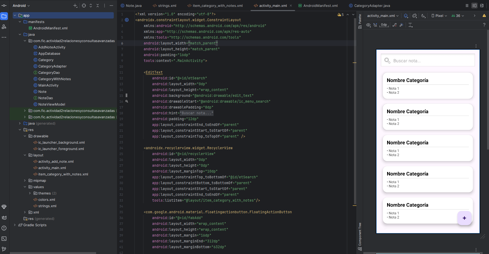
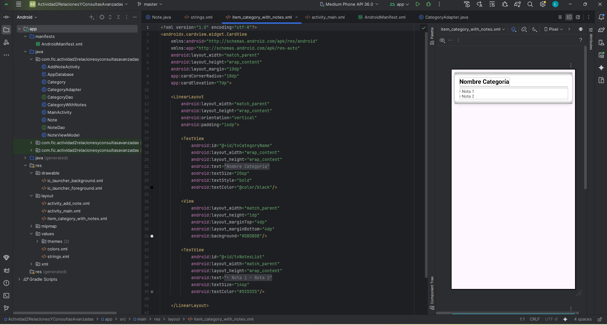
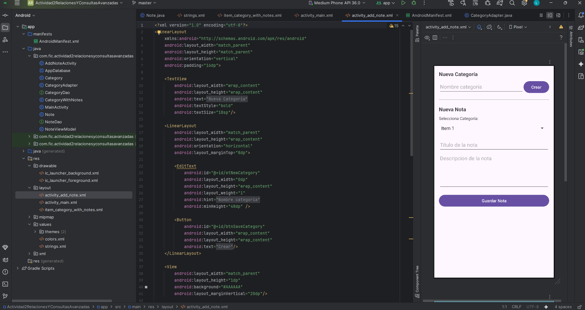

#elaborado por Aceves Sanchez Luis Rafael
# Actividad 2: Gestión de Notas con Relaciones Avanzadas

## Descripción General

Este proyecto implementa una aplicación Android para la gestión básica de notas, centrándose en el uso de la arquitectura **Model-View-ViewModel (MVVM)** y la librería de persistencia **Room**.

El objetivo principal fue demostrar la correcta implementación de una relación **Uno a Muchos (1:N)**, donde múltiples notas pueden pertenecer a una sola categoría, y la realización de consultas avanzadas que agrupan los resultados.

---

## 🔑 Características Implementadas

Esta aplicación cumple con los siguientes requisitos funcionales:

1.  **Relación 1:N:** Definición e implementación de la relación entre la entidad `Category` (Categoría) y la entidad `Note` (Nota).
2.  **Agrupación Avanzada:** La interfaz principal (`MainActivity`) muestra todas las notas **agrupadas bajo su categoría correspondiente**.
3.  **Inserción de Datos:** Interfaz secundaria (`AddNoteActivity`) para crear nuevas categorías y asignar notas a categorías existentes.
4.  **Operaciones Asíncronas:** Todas las operaciones de la base de datos (Inserción, Consulta) se ejecutan en hilos de fondo, usando coroutines de Java integradas en Room.

---

## 📂 Esquema de la Base de Datos (Room)

La estructura de la base de datos se basa en dos entidades principales y una clase de apoyo para la relación:

### Entidades

| Entidad | Campo Clave | Tipo | Descripción |
| :--- | :--- | :--- | :--- |
| **Category** | `category_id` (PK) | `int` | Identificador único de la categoría. |
| **Note** | `note_id` (PK) | `int` | Identificador único de la nota. |
| | `category_id` (FK) | `int` | **Llave foránea** que vincula la nota a una categoría. |

### imagenes de evidencia

